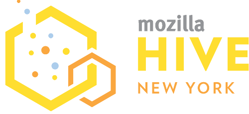

# Hive Learning Network NYC

Hive NYC is a peer-to-peer learning network. We:
* **develop**, **share** and **scale**
* new **ideas**, **tools** and **approaches to learning**,
* **unlocking opportunity for young people**
* through **problem-solving**, **creativity** and **digital skills**.

The first of Mozilla's growing community of city-wide networks, aiming to revolutionize learning in New York City and beyond. Hive NYC programs advance **[connected learning](http://clalliance.org/)** and **[web literacy](https://webmaker.org/en-US/resources)**.

## Get Involved

Hive NYC acts as a distributed learning laboratory where innovations are both developed and spread. Activities take place in multiple locations across the city and involve a diversity of participants. We invest in educators' ability to create digitally rich programs for youth, embedding innovations across organizations.

At Hive NYC, community members learn together, network with each other, consult, advise, discuss best practices and pedagogies, try out new technologies, engage in funded partnerships, design charettes and events, participate in affinity groups and cooperate to solve problems. Most importantly, **we collaborate to design and implement transformative learning opportunities for and with NYC youth**.

You are invited to join our community.
