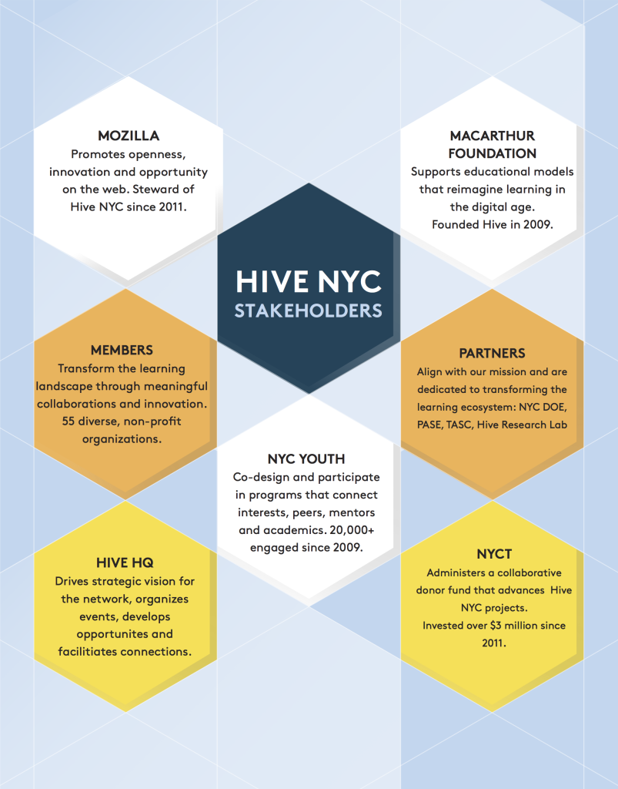

# Hive NYC Overview

Hive Learning Networks are city-based, city-wide vehicles for implementing and spreading ***connected learning ideas, tools, practices and values***.

Founded by MacArthur and Mozilla Foundations, Hive Learning Networks prepare youth to thrive in school, work, and civic life. Dedicated to unlocking opportunities for all young people, Hive Learning Networks empower educators to build connected learning experiences and teach the digital skills essential for young people to shape their world.

Hive Learning Networks represent a bold, dynamic model of connected learning in action, reflecting the ***reality and opportunities of the Internet era***. As Mark Surman, Executive Director of the Mozilla Foundation, explains:
>"Connected learning is the best, fastest and deepest way to ensure that the greatest number of people can learn effectively anytime, anyplace and at any pace, both in school and beyond."

For this reason, Hive Learning Networks plan to grow over the next five years, continuing to drive essential change in traditional belief about learning.

Through participation in Hive, civic and cultural organizations, businesses, entrepreneurs, educators and learners of all ages and backgrounds can **build**, **shape**, **teach** and **learn** ***together***.

## Hive in NYC
Hive NYC is the flagship learning network in the growing Hive ecosystem. The history of Hive New York dates back to 2009 when the MacArthur Foundation asked three principal investigators (Diana Rhoten, Phoenix Wang, and Colleen Macklin) to write a proposal for starting a learning network.

Initially called New Youth City Learning Network, the network recognized that youth were pursuing their own interests and paving their own learning pathways by piecing together multiple sources of information and sites of interaction, unassisted—both in physical and virtual spaces.

Rhoten, Wang and Macklin proposed that a network with a focus on learning could help more youth make these vital, “geeky” connections.

Along with MacArthur, this group of investigators curated six NYC-based, youth-serving organizations to become the founding members of The New Youth City Learning Network. Those organizations were: Cooper-Hewitt National Design Museum, Global Kids, MOUSE, New York Hall of Science, New York Public Library and Parsons The New School for Design.

Parsons was identified as the design and technology production node, established to assist the other organizations in creating new, relevant learning products for a connected and networked environment. The Center for Social Sciences Research was identified as the steward and research partner.

After a formal request for proposals, three initial projects were chosen. The projects were asked to adhere to the following guidelines:
* at least three organizations serving as collaborators
* a commitment to the Citizen Scientist, Designer, Journalist paradigm
* a readiness to leverage ideas about neighborhoods and local, situated learning

During Fall 2009 at NYC's first World Maker Faire, New Youth City Learning Network featured its collaborative projects.

In 2010, The New York Community Trust and the MacArthur Foundation teamed up to create Hive Digital Media Learning Fund in New York Community Trust so that together, kids, teachers, scientists, and artists can design new and exciting ways to learn, create, and participate beyond the classroom.

## Hive NYC Stakeholders

The following organizations and partners take an active role in driving the strategic direction of Hive NYC.

### Hive NYC HQ
Hive NYC’s leadership team oversees and guides the work of the network—connecting members, facilitating partnerships, investigating opportunities, hosting events and more. We are dedicated to pushing the boundaries of learning and, to that end, facilitate collaboration between innovators and changemakers in education, technology, digital media, design and youth development.

Most importantly, [Hive NYC HQ is not a funder](http://hivenyc.org/2012/10/05/hive-learning-network-nyc-is-not-a-funder/). As a non-voting member of Hive DML Fund, Hive NYC leadership offers expertise and counsel but does not vote on who is awarded project funds.

Hive NYC HQ personnel are employees of Mozilla, based in an office in Dumbo, Brooklyn.

We are:
* [Leah Gilliam](https://twitter.com/leahatplay), Director, Mozilla Hive NYC Learning Network
* [Julia Vallera](https://twitter.com/colorwheelz), Programs Manager, Mozilla Hive NYC Learning Network
* [Chris Lawrence](https://twitter.com/chrislarry33), Vice President Learning, and Senior Director Hive Learning Networks, Mozilla
* [Lainie DeCoursy](https://twitter.com/lainiedecoursy), Programs Manager, Mozilla Hive Learning Network

### Mozilla
[Mozilla](http://mozilla.org) became the steward of Hive NYC in 2011. Through its [Webmaker](http://webmaker.org) initiative, Mozilla is dedicated to teaching digital skills and web literacy—building a web that’s open and participatory. Hive Learning Networks are a project within the global Webmaker Community, which is comprised of educators, technologists and others who want to explore, tinker and create with the web, sharing their knowledge with others.

Mozilla’s Firefox browser is the product of a community of volunteers working in conjunction with the core team. This extensive global network of developers makes Firefox an illustrative demonstration of the power of collaboration. Mozilla’s management structure supports the open culture of peer production that generates and continually improves the most trusted browser in use.

### The MacArthur Foundation
The [MacArthur Foundation](http://www.macfound.org) founded Hive Learning Networks through its Digital Media and Learning initiative. MacArthur provides support for Hive NYC through its participation in the Hive Digital Media Learning Fund in the New York Community Trust, and through the direct support of Mozilla and its mission. The principles of the Digital Media and Learning portfolio and Connected Learning are diverse but closely related. Providing a fertile ground for re-imagining learning in a digital age, the Hive Learning Networks aim to put these principles into action through their efforts to link anytime, anywhere learning opportunities within urban centers.

### New York Community Trust (NYCT)
The [New York Community Trust](http://www.nycommunitytrust.org/) has worked with Hive NYC to develop a robust, incubating environment. This ecosystem frequently fuels the launch of learning tools, practices and programs that map to an iterative design process. The [Hive Digital Media Learning Fund in The New York Community Trust](http://www.nycommunitytrust.org/AboutTheTrust/CollaborativeFunds/HiveDigitalMediaLearningFund/tabid/620/Default.aspx) has invested more than $5.3 million in grants to Hive NYC members and their collaborators since 2011. In addition to MacArthur and The Trust, donors include: The Altman Foundation, Mozilla Foundation, David Rockefeller Fund, the Renate, Hans and Maria Hofmann Trust, the Stavros Niarchos Foundation, and the Joan Ganz Cooney and Beth M. Uffner funds in The Trust.

### Hive Research Lab
[Hive Research Lab](http://hiveresearchlab.org/) is an applied research partner of Hive NYC, and represents a collaboration between Indiana University and New York University. Its mandate is to investigate and strengthen the network as a context for innovation in out-of-school learning organizations and to support interest-driven learning by young people.

### Network Partners
Hive NYC also has partnerships with organizations and networks within the New York City learning landscape, including the Department of Education, Department of Youth and Community Development, the Fund for Public Schools,  NYC DOE [Office of Postsecondary Readiness](http://schools.nyc.gov/Offices/OPSR/default.htm), NYC Parks Computer Resource Centers, [Partnership for After School Education](http://pasesetter.org/) (PASE), Scholastic Art and Writing Awards, The [After School Corporation](http://www.tascorp.org/) (TASC) and others.

### Community Members
The ongoing commitment and contributions of Hive NYC members enable the network to pursue its mission and have an impact on the lives of young people. Educators and institutions are empowered to innovate around the ideas, practices, and tools associated with Connected Learning through funded collaborations, meet-ups, events and online/offline communities of practice. By modeling networked behavior and open participation, educators in Hive NYC learn with and from one another, organizing to build new approaches that transform the city’s learning ecology. Ultimately, the community helps young people to discover their agency, pursue their passions and take control over their future learning, work and civic lives.

### Youth
Hive NYC programs primarily serve public school youth (middle and high school-aged) from all five boroughs. These programs help young people develop competencies in the following areas:
* Advocacy/Social Justice
* Art and Design
* College and Career Readiness
* Critical Thinking and Collaboration
* Digital and Web Literacy
* Media Production
* Games and Systems
* Science, Technology, Engineering, Math (STEM)
* Youth Development and Leadership

## Hive Digital Media and Learning Fund
Hive NYC’s lead member organizations are non-profit, youth-facing organizations committed to working together to create learning experiences that connect young people to opportunity. Lead organizations within Hive NYC have access to the DML Fund.

The Hive Digital Media Learning Fund was seeded in 2010 by the John D. and Catherine T. MacArthur Foundation and The New York Community Trust as a collaboration of grantmaking organizations who promote adolescents’ learning through digital media. The Fund releases two Requests for Proposal (RFP) per year, available to members of the Hive NYC Learning Network (Hive NYC), to support their work via grants ranging in size from $500 to $250,000. In addition to MacArthur and The Trust, current donors include the Altman Foundation; Renate, Hans, and Maria Hofmann Trust; Mozilla Foundation; Stavros Niarchos Foundation; and David Rockefeller Fund.

The Fund’s grants support innovative Connected Learning projects that explore how digital media technologies are changing the way youth are learning, facilitate the interaction among Hive NYC members and spread learning innovations to a wide audience.

The Hive DML Fund’s grants are awarded through a competitive process. All proposals are reviewed by a committee composed of representatives from the Fund’s Advisory Committee, which includes its major donors and City agency representation, and a representative from another Hive Learning Network. The Committee’s recommendations are reached by consensus. Hive NYC staff consult during the proposal review but do not vote on grant recommendations. Reviewers recommend a slate of grants to the president of The Trust for approval.

Selected projects demonstrate an entrepreneurial approach to addressing the needs and interests of youth, in which learning with digital media is active and participatory; youth are motivated because they pursue subjects that are personally meaningful and technology connects communities of learners with shared interests. Effective digital media and Connected Learning programs respond to youth interests and create social structures and academic pathways that support youth as they acquire knowledge and experiment with/ master new skills.

See [Hive DML Fund Eligibility](../leadership_in_hive_nyc/being_a_lead_contributor/hive_dml_fund_eligibility/README.md) for more.
