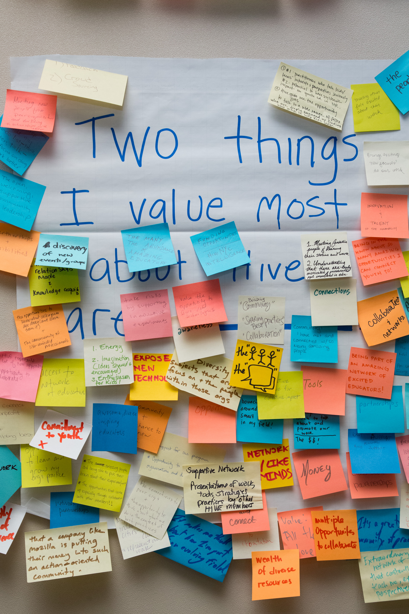
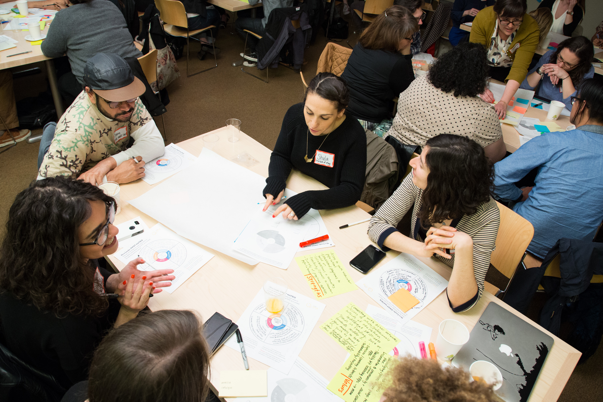

# How Does Hive NYC Work?

Hive NYC is a **network for learning** and a **network that learns**:
* Creating new pathways for youth to learn valued skills.
* Sharing resources and best practices, advancing professional development.

Hive NYC HQ provides an infrastructure of support:
* [Exchanges](#exchanges) - _communication and skill sharing_
* [Experiments](#experiments) - _collaborative problem solving_
* [Exemplars](#exemplars) - _learning from findings_

By operating within the Mozilla Learning community, members are able to expand projects to broaden and/or deepen their impact:
* [How We Spread and Scale](#how_we_spread_and_scale)

### Exchanges

Hive NYC facilitates a range of **live forums** for community members to meet, network and share discoveries. We also connect via various **regular activities**—you are welcome to join any of these.

Hive NYC supports the **professional development** of our community members through workshops and trainings. Participants are encouraged to share their own expertise and resources.

Hive NYC provides opportunities for community members to demo and play-test their programs and ideas, using an **iterative design and implementation** approach. These events contribute to the ***spread and scale*** of tools and practices developed in the network.

### Experiments

Hive NYC encourages collaboration between community members to identify challenges and design/build solutions. Working together to create models that can replicated and remixed amplifies Hive Learning Networks' collective impact.

### Exemplars

Hive NYC contributors are together engaged on a continual process of learning and discovery. Past projects inform the methods we use to advance our shared aims.

>  ***[Wagner TecKids U Lab](http://hivenyc.org/portfolio/wagner-teckids-u-lab/)***  By collaborating with Tech Kids Unlimited to provide special needs kids with technology learning opportunities, staff at Wagner College Education Department gained proficiency in digital and multimedia tools to support the learning process.

> ***[Playable Fashion](http://hivenyc.org/portfolio/playable-fashion/)***  Eyebeam partnered with various Hive members to explore the intersections between fashion, technology and gaming, with youth creating custom wearable controllers informed by their own narratives.

> ***[Design, Collaborate, Integrate](http://hivenyc.org/portfolio/design-collaborate-integrate/)***  Through a participatory development process, Brooklyn College Community Partnership engaged young Brooklyn College Art Lab users in the co-design of a maker space to meet the needs of all youth regardless of race or class background.

> ***[Smartphone Photography Project](http://hivenyc.org/portfolio/smart-phone-photography-project/)***  NYC SALT developed a curriculum to explore the use of social media in digital photography, adopting online interaction styles to create a participatory experience.

For more exemplars, see the [portfolio](http://hivenyc.org/portfolio/).

## How We Spread and Scale

Hive NYC supports spread and scale of member programs to expand in terms of new contexts/partnerships, to develop content, and to reach more youth.

By connecting to the [wider Mozilla community](../why_mozilla/README.md), Hive NYC provides channels to showcase findings and engage in global exchange. In addition, members have access to relevant trainings, such as the [series of workshops run by PASE (Partnership for After School Education)](http://hivenyc.org/2015/03/18/pase-spread-and-scale-recap/) for members planning for spread and scale.
