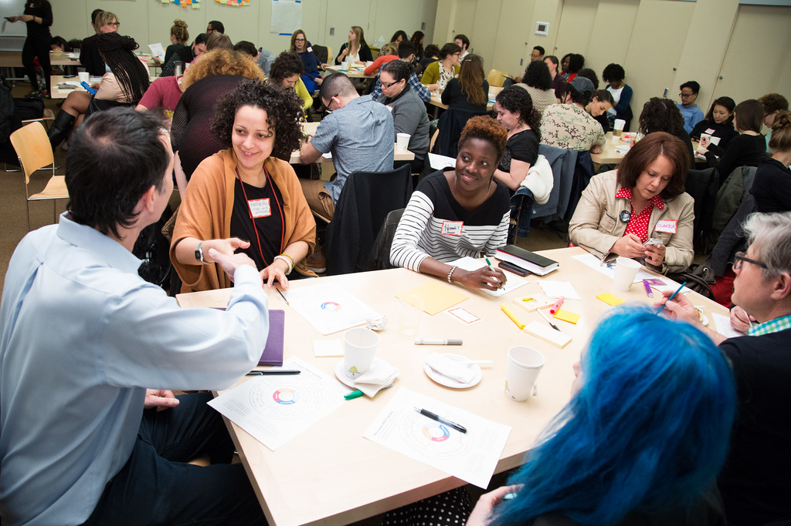

# Pathways to Participation

***As a Hive NYC community member, you are encouraged to explore any and all avenues you feel will allow you to participate as fully as possible.***

The following three general tiers of engagement with Hive NYC have been identified:
* **Explore**
 * *Use your involvement to meet, make and learn with others.*
* **Participate**
 * *Exchange expertise, get involved at events, activities or meetings.*
* **Lead**
 * *Innovate and scale web literacy and connected learning programs across NYC.*

These are not prescriptive, fixed roles—they describe [patterns of behavior observed in existing participants](http://hivenyc.org/2013/08/31/exploring-how-organizations-interface-with-hive-nyc/). Hive NYC is a self-organizing community of practice and [each member connects differently](https://drive.google.com/file/d/0B_VM3QApL9XfSm12dnJZN1dFRWM/view). Entry points and [trajectories are varied](http://hivenyc.org/2014/01/28/seven-months-hivenyc-new-member-share/)—however, **your contribution will be valued, whatever form it takes**.
