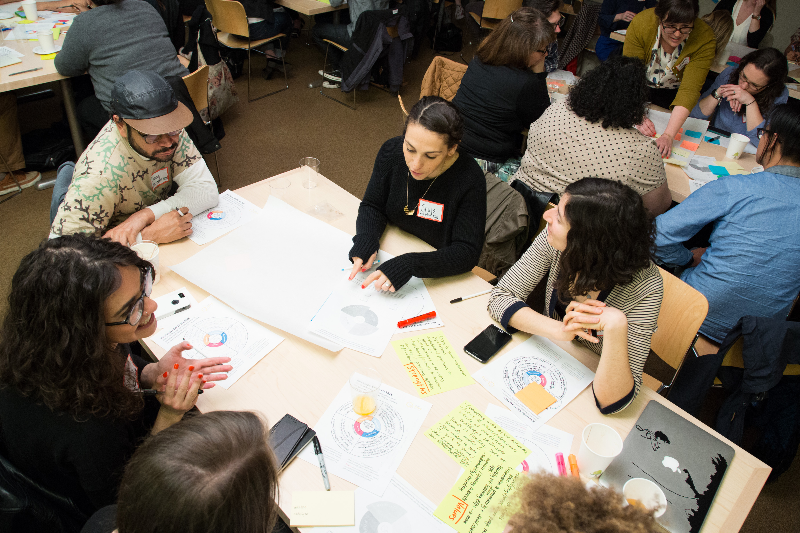

# Spread and Scale

By operating within the Mozilla Learning community, members are able to expand projects to broaden and/or deepen their impact in terms of new contexts/partnerships, develop content, and reach more youth.

Hive NYC provides channels to showcase findings and engage in global exchange. In addition, members have access to relevant trainings, such as the [series of workshops run by PASE (Partnership for After School Education)](http://hivenyc.org/2015/03/18/pase-spread-and-scale-recap/) for members planning for expansion.
