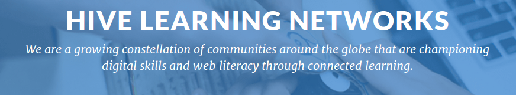

# Networked Learning

In the digital age, the fundamental mode of operation and delivery is the network. By recognizing this, organizations and individuals can coordinate to work together, fostering dynamic, rewarding situations beyond what each could do alone.

In the networked context, learning is **connected**, **meaningful**, **easily accessed** and **in alignment with local interests**. Mentors and educators support youth in curating a diversity of skills to navigate *education, career and community life*—this means moving beyond the bounds of traditional classroom environments.

> Invention often happens at the intersection of diverse people and ideas. Hive NYC programs frequently generate solutions that address common challenges.

Participating members have a wide range of missions, youth populations, institutional sizes, disciplines, strategies and areas of expertise/focus. However, **we share a clear set of values and aspirations**.

Community members engage with the principles of connected learning in both program design and professional practice. Contributors use **openly-networked collaboration** that includes *peer observation*, *resource sharing* and *process documentation*.

