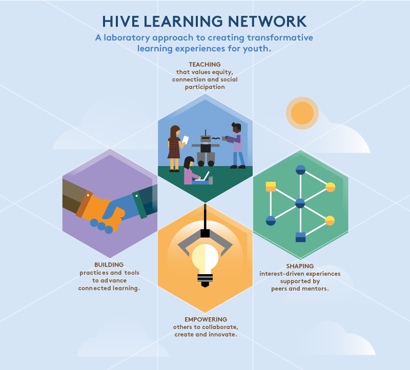

# Vision and Goals

Over the next five years, Hive's ambitious goals in support of its vision are:
* **Mobilize** more educators to adopt [connected learning](http://clalliance.org/) practices and teach [web literacy](https://webmaker.org/en-US/resources) within a growing constellation of Hive Learning Networks.
* **Create** high-quality connected learning and web literacy tools, content, curriculum and practices for broad use.
* **Catalyze** schools, youth programs, and city agencies to provide rich connected learning and web literacy programs, especially in under-served communities.
* **Grow** demand for Hive Learning Events, Communities and Networks in new locations and sectors.

When more youth have access to relevant connected learning experiences and gain new digital skills, and educators and organizations make connected learning central to their practices, Hive will have realized its ambitious vision of educational transformation.

For more see [Hive Learning Networks’ Vision, Goals and Conditions for Impact](http://hivenyc.org/2014/07/10/hive-learning-networks-vision-goals-and-conditions-for-impact/).
